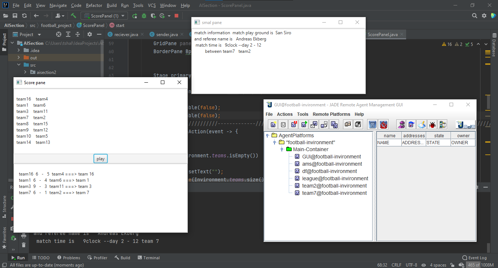

# footbool_cup_simulation_using_AOP
jade project for footbool cup

to run the project add the jade library in the lib folder to your project libraries

this project run league between 16 teams then between 8 then between 4 then between 2 then the winner

